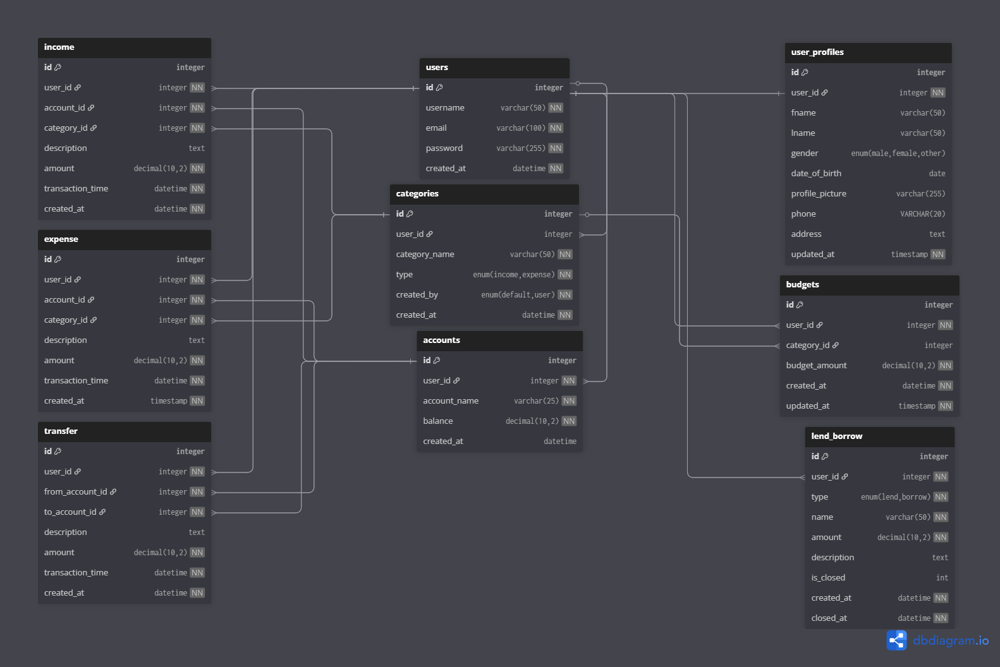
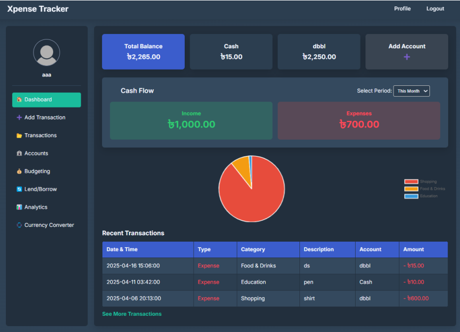

# Xpense-Tracker

Xpense-Tracker is a web-based personal finance management system that helps users track income, expenses, budgets, and financial insights in real time. It is built using raw PHP and MySQL following a clean MVC architecture.

---

## 🚀 Features

- User authentication with secure session management, including Signup, Login, and Forgot Password.
- Interactive dashboard displaying balance overview, cash flow, and recent transactions for selectable periods (week, month, year).
- Multiple account management with seamless handling of transactions across different accounts.
- Income and expense tracking with category-based classification, along with inter-account transfer tracking.
- Real-time transaction listing with AJAX-powered searching and filtering by type, category, amount, and date range without page reloads.
- Budget management for selected time periods or specific expense categories with progress tracking.
- Lend and borrow tracking with status management (open and closed).
- Advanced financial analytics with interactive and dynamic charts.
- Real-time currency conversion using an external exchange rate API.
- Offline support enabled through a service worker (PWA-ready).
---

## 🛠 Tech Stack

- **Frontend**: HTML, CSS, JavaScript, jQuery, Chart.js
- **Backend**: PHP (Raw), MySQL
- **Tools**: XAMPP (Apache, PHP, MySQL)
---

## 🏗 Architecture

The application follows the **MVC (Model–View–Controller)** architecture:
- **Model**: Database interaction and business logic  
- **View**: UI rendering  
- **Controller**: Handles requests and application flow  

This keeps the codebase modular, maintainable, and scalable.

---

## 📂 Project Structure
```
xpense-tracker/
├── app/
│ ├── config/          # Database & app configuration
│ ├── controllers/     # Request handlers
│ ├── core/            # Base MVC core classes
│ ├── models/          # Database models
│ └── views/           # UI views (feature-based)
├── public/
│ ├── assets/
│ │  ├── css/
│ │  ├── images/
│ │  └──  js/
│ ├── index.php        # Application entry point
│ ├── manifest.json    # PWA manifest
│ ├── offline.html     # Offline fallback
│ └── service-worker.js
```

By using this clear folder structure, the application remains organized, maintainable, and scalable. Each component has a well-defined role, and the separation of concerns between Model, View, and Controller makes the codebase easier to manage.

---

## 🗄 Database Schema



## 🔐 Security Measures

- Password hashing using bcrypt
- Prepared statements (SQL Injection prevention)
- Input sanitization (XSS protection)
- Secure session handling

---

## 📸 Preview


